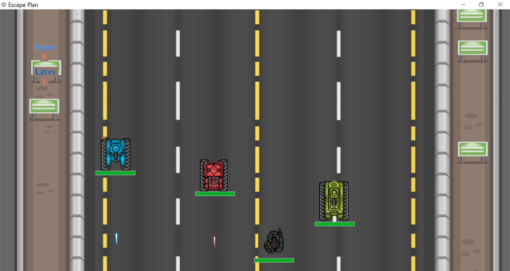
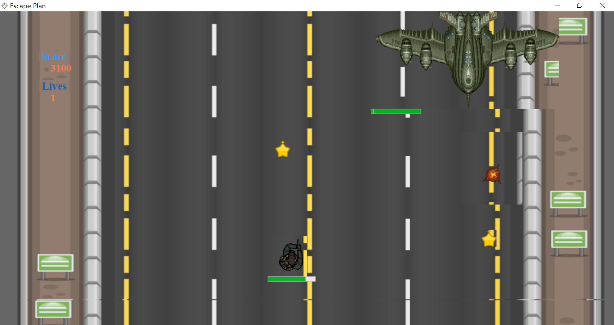
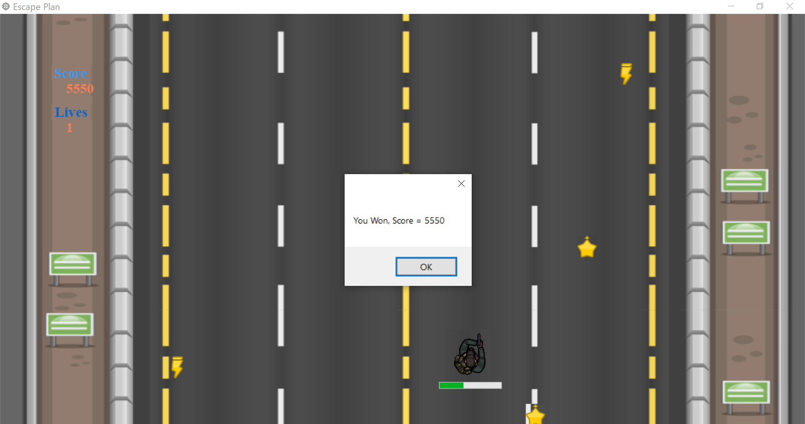

# Escape Plan

**Escape Plan** is an immersive Windows Form game developed in C# that highlights advanced Object-Oriented Programming (OOP) techniques, including Interfaces, the Singleton pattern, and Enumerations. Player controls a dynamic character navigating the battlefield of tanks and bullets. The goal is to dodge incoming tanks, evade gunfire, and counterattack to emerge winner.

## Table of Contents
- [Features](#features)
- [Screenshots](#screenshots)
- [Usage](#usage)
- [Documentation](#documentation)
- [Technologies Used](#technologies-used)
- [Contributing](#contributing)
- [License](#license)

## Features
- **Modular Design DLL Framework**: Backend logic of the game developed as a separate DLL framework, making it adaptable to other games frontend UI.
- **Dynamic Character Control**: Players navigate a character through a challenging battlefield.
- **Advanced OOP Concepts**: Utilizes Interfaces, the Singleton pattern, and Enumerations for a robust code structure.
- **Tank and Bullet Mechanics**: Engage in combat against tanks while avoiding incoming fire.

## Screenshots

## Usage
1. Clone the repository:
   `git clone https://github.com/miansaadtahir/EscapePlan.git`
2. Navigate to the project directory:
   `cd EscapePlan/ Consumer/ bin/ Debug/`
3. Launch the `Consumer.exe` file.

## Documentation
For a detailed overview of the gameplay mechanics and features, refer to the [Documentation](./documentation) in the repository.

## Technologies Used
- C#

## Contributing
Contributions, issues, and feature requests are welcome!  
Feel free to check out the [issues page](https://github.com/miansaadtahir/EscapePlan/issues) for more information.

## License
Distributed under the MIT License. See [LICENSE](./LICENSE) for more details.
